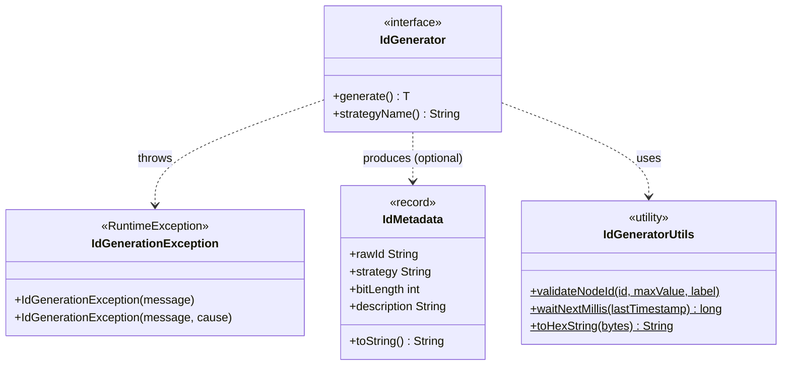
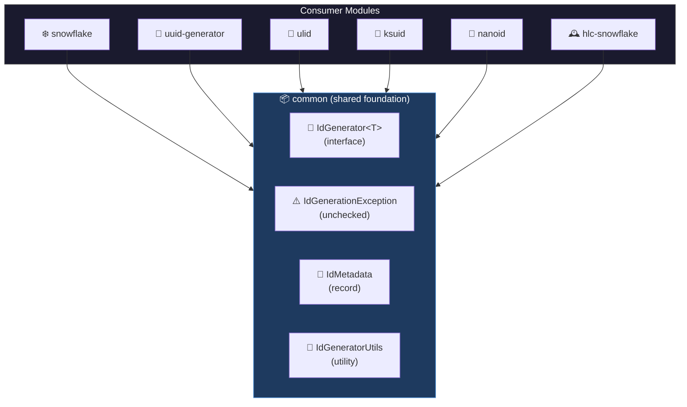
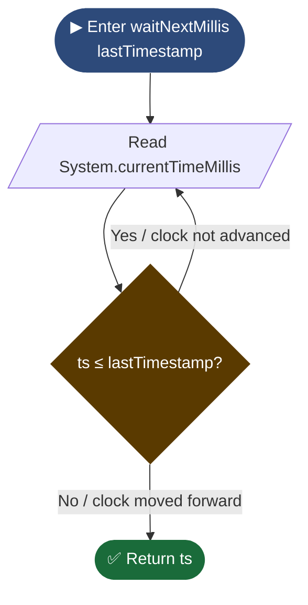
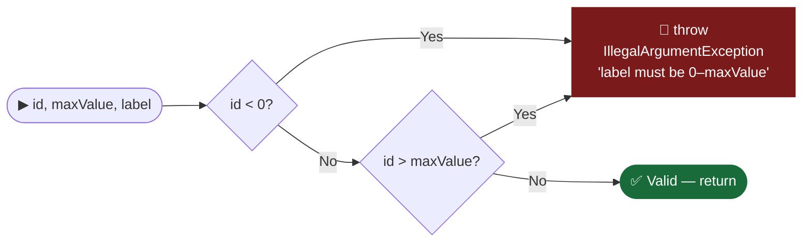

# Common Module — Diagrams

## 1. Class Diagram — Shared Contracts & Utilities

---

## 2. Component Diagram — Module Dependency Graph

---

## 3. Flowchart — `IdGeneratorUtils.waitNextMillis()` spin-wait logic

---

## 4. Flowchart — `IdGeneratorUtils.validateNodeId()` guard logic

