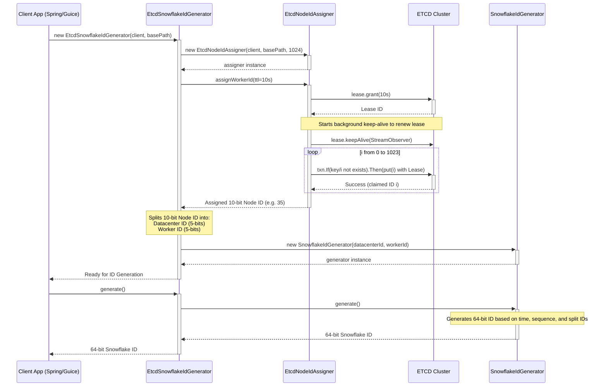
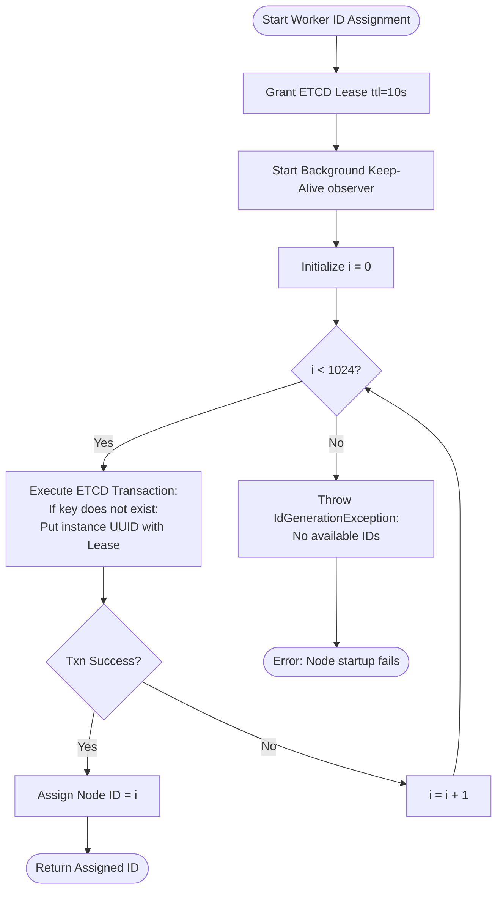
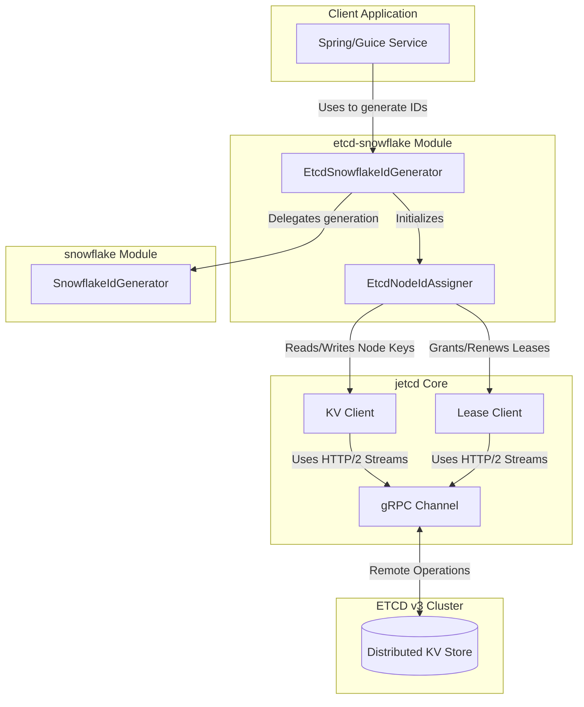

# etcd-snowflake Diagrams

This document illustrates the internal architecture, initialization flow, and component structure of the `etcd-snowflake` generator module. This module enables distributed coordination of standard 64-bit Snowflake datacenter and worker IDs using an ETCD V3 Backend.

## 1. Sequence Diagram: Initialization and Generation
This diagram shows how a client application initializes `EtcdSnowflakeIdGenerator` which then requests an exclusive worker node ID via `EtcdNodeIdAssigner`. ETCD uses leases to ensure that node IDs are safely reused if a node crashes or disconnects.

## 2. Flowchart: Worker ID Assignment Algorithm
This flowchart details the algorithm used by `EtcdNodeIdAssigner` to negotiate and claim an available coordinate ID over ETCD KV. It ensures unique ID ownership through lease-bound strictly atomic `txn` (transaction) commands.

## 3. Component Diagram
This diagram outlines the relationships and dependencies among the core architectural and structural components of the `etcd-snowflake` generator. 

