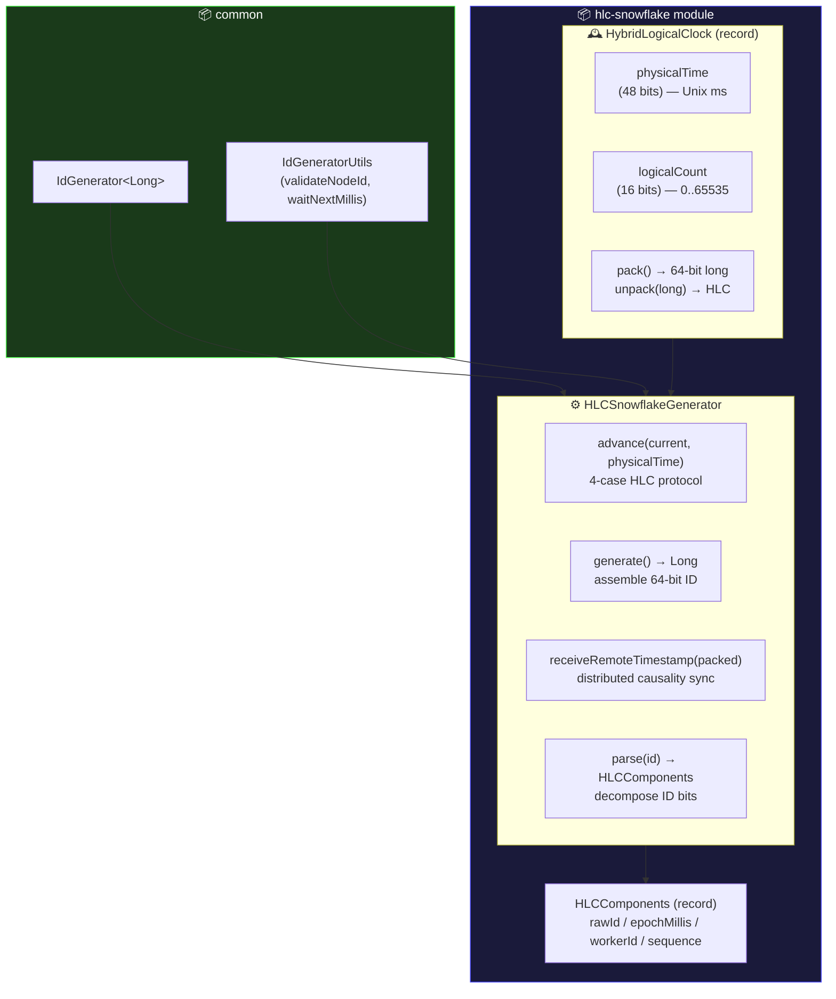
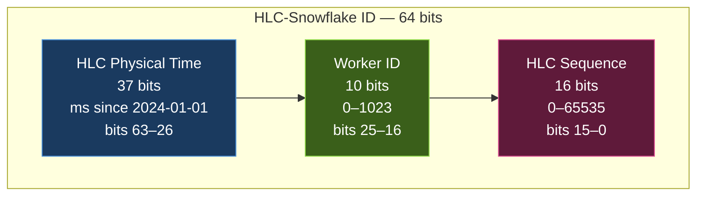
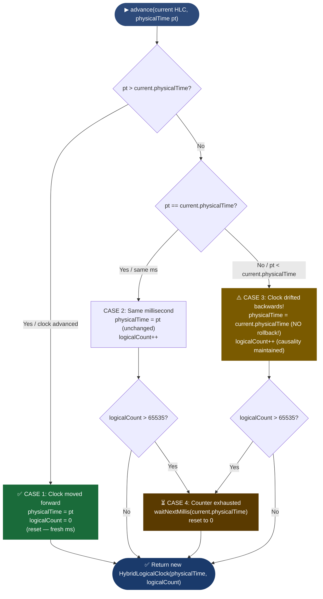
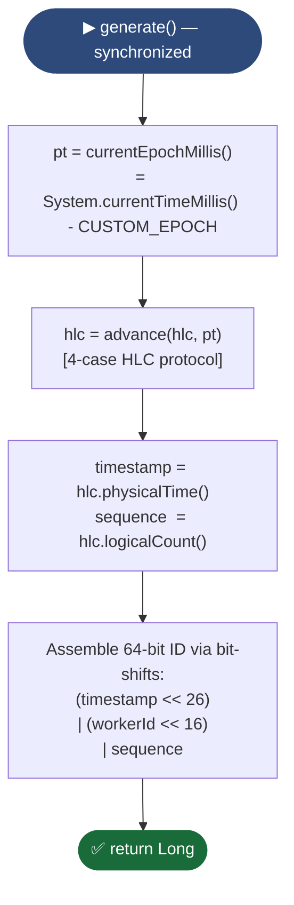
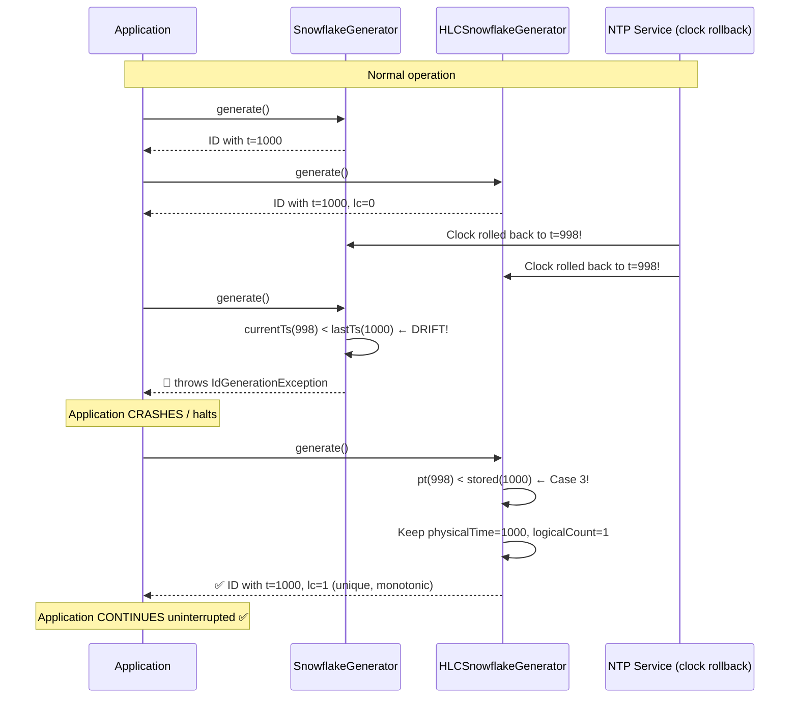
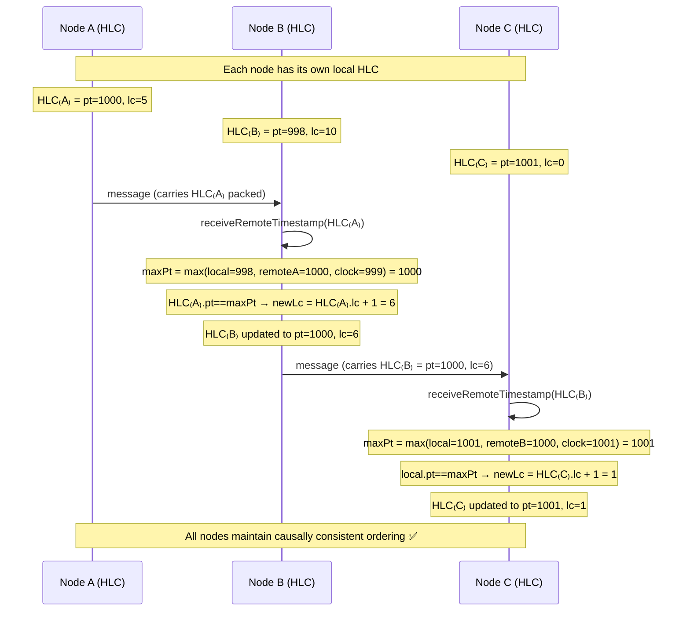
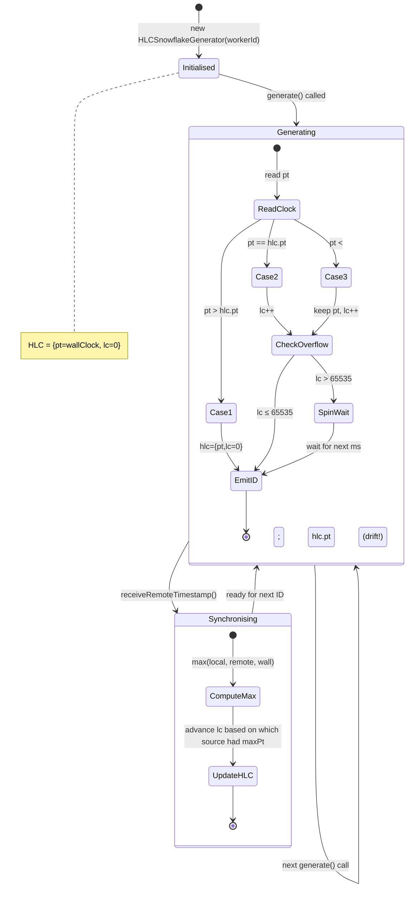
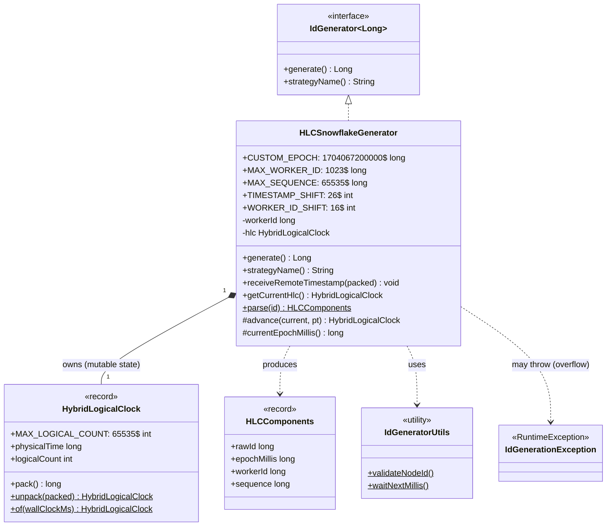
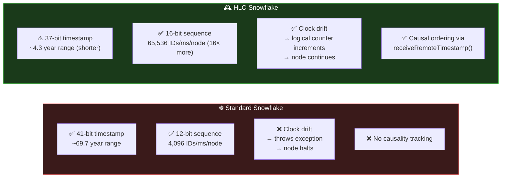

# HLC-Snowflake Module — Diagrams

## 1. Component Diagram — HLC-Snowflake architecture

---

## 2. Bit-Layout Diagram — 64-bit HLC-Snowflake ID

> **vs. Standard Snowflake**: Trades timestamp range (37 vs 41 bits → ~4.3 vs ~69.7
> years) for a 16-bit sequence (65,536 vs 4,096 IDs/ms/worker). Combined with HLC's
> logical counter, this offers far greater burst throughput.

---

## 3. Flowchart — The 4-case HLC `advance()` protocol

---

## 4. Flowchart — `HLCSnowflakeGenerator.generate()` end-to-end

---

## 5. Sequence Diagram — Standard Snowflake vs HLC on clock drift

---

## 6. Sequence Diagram — Distributed remote timestamp reception

---

## 7. State Diagram — HLC lifecycle

---

## 8. Class Diagram — Complete HLC-Snowflake structure

---

## 9. Comparison — Snowflake vs HLC-Snowflake

