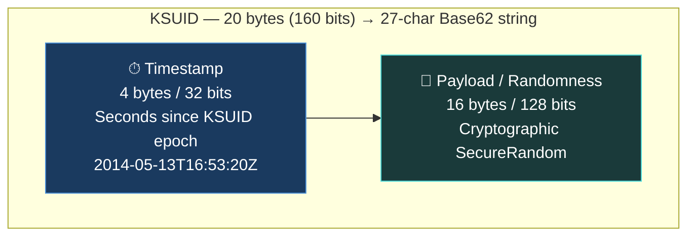
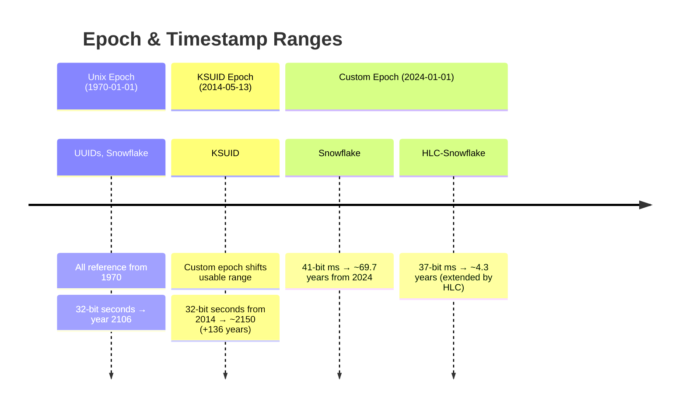
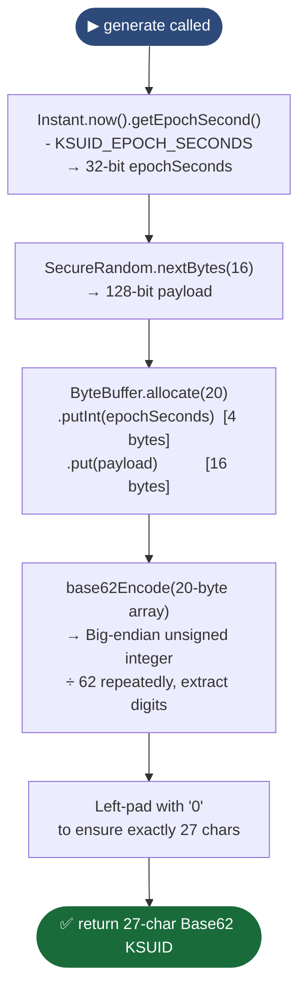
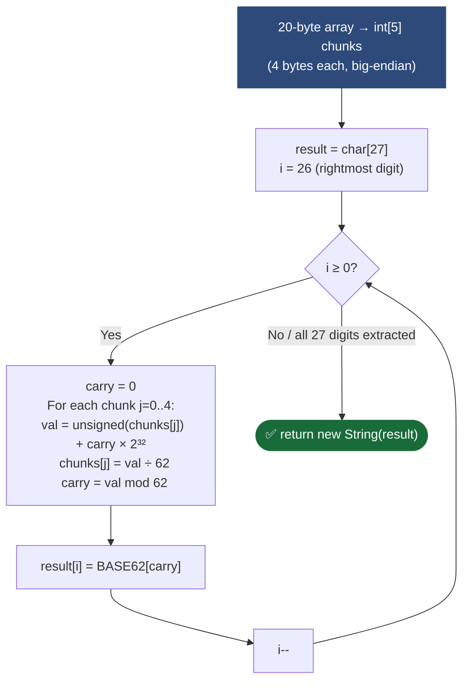
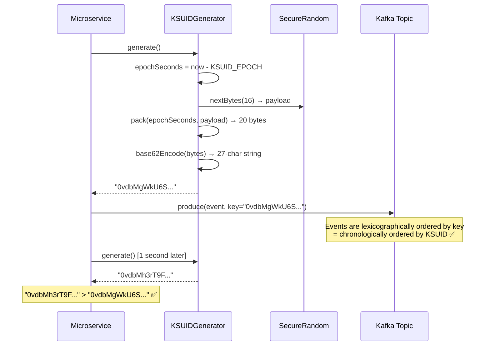
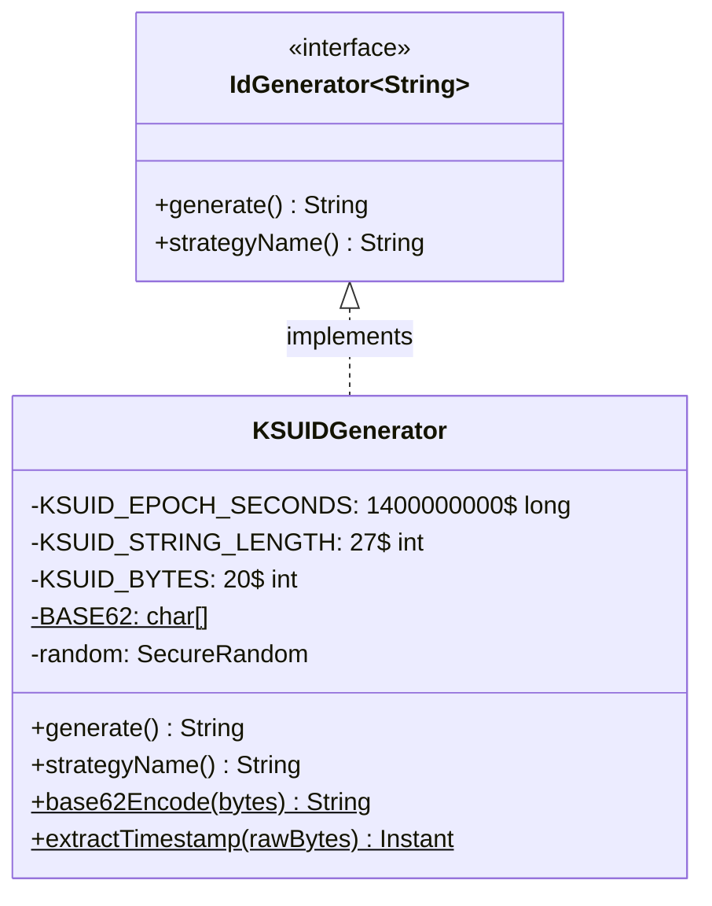
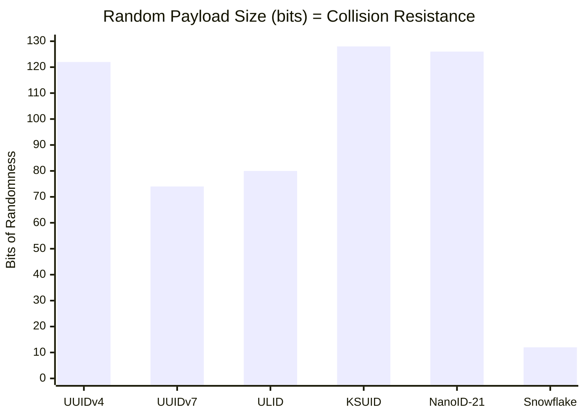

# KSUID Module — Diagrams

## 1. Structure Diagram — Anatomy of a 20-byte KSUID



**Example:** `0vdbMgWkU6SlqpNAssets4pMLhH`
```
Bytes 0–3      Bytes 4–19
──────────     ──────────────────────────────────────────────────────
Timestamp      128-bit random payload
(seconds)
```

---

## 2. Epoch Comparison Diagram



---

## 3. Flowchart — `KSUIDGenerator.generate()` algorithm



---

## 4. Flowchart — `base62Encode()` big-endian division algorithm



---

## 5. Sequence Diagram — KSUID generation and event-store usage



---

## 6. Class Diagram



---

## 7. Comparison — Collision resistance across strategies



> **KSUID** has the largest random payload (128 bits), making it the most
> collision-resistant string ID in this project. The trade-off is a coarser
> 1-second timestamp granularity.
