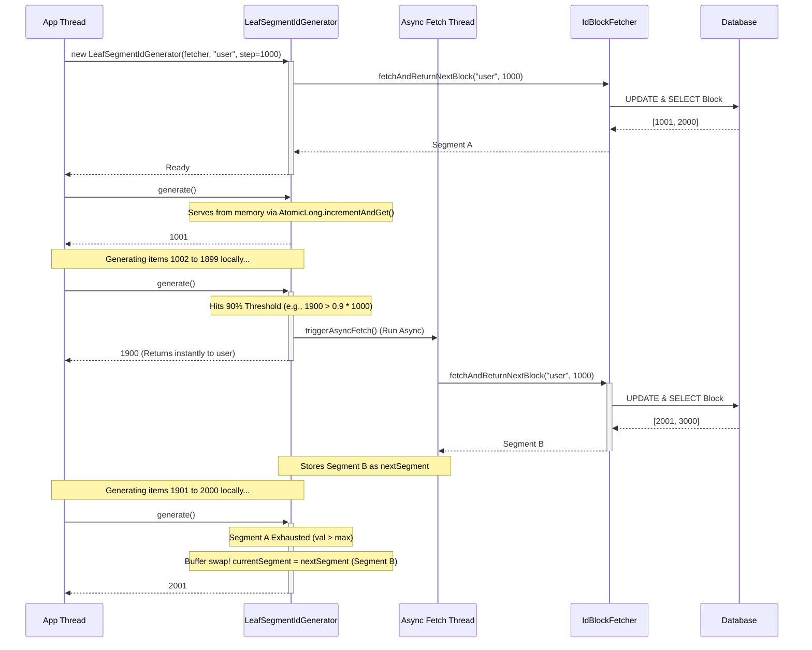
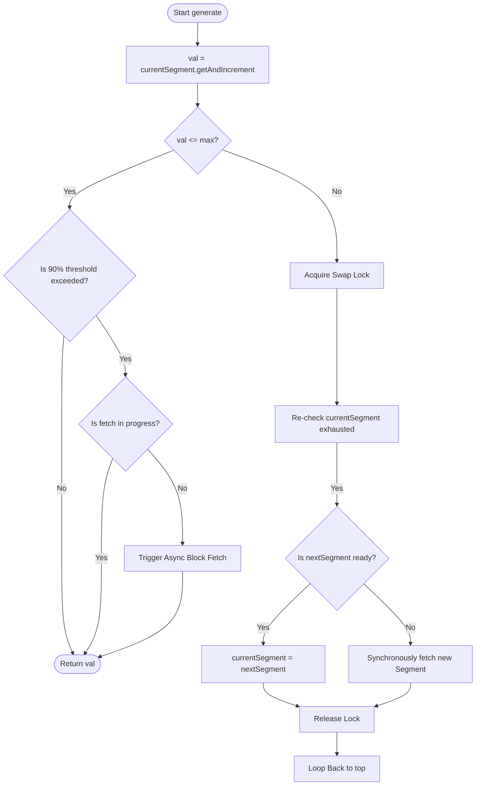
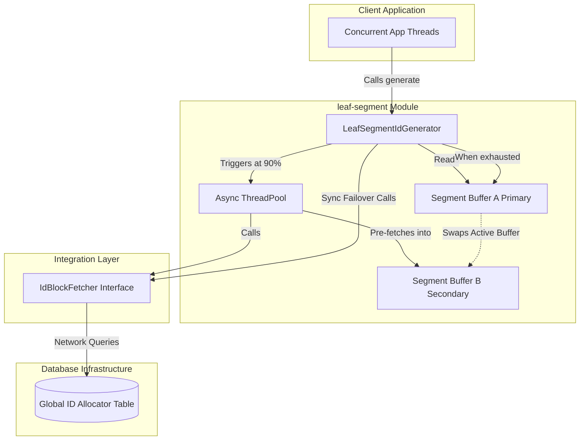

# leaf-segment Diagrams

This document illustrates the internal architecture, block pre-fetching flow, and component structure of the `leaf-segment` (Dual-Buffer Block Allocation) ID generator module.

## 1. Sequence Diagram: Dual-Buffer Pre-Fetching
This sequence diagram shows how the system yields high throughput by serving requests directly from memory, while asynchronously pre-fetching the next segment in the background right before the current buffer exhausts.

## 2. Flowchart: Generation Algorithm with Threshold
This flowchart demonstrates the `generate()` logic and how the engine determines when to trigger background tasks without blocking the main application thread.

## 3. Component Diagram
Structural view of how the dual-buffer generator decouples the application thread from the database infrastructure using the memory layout interface abstract.

