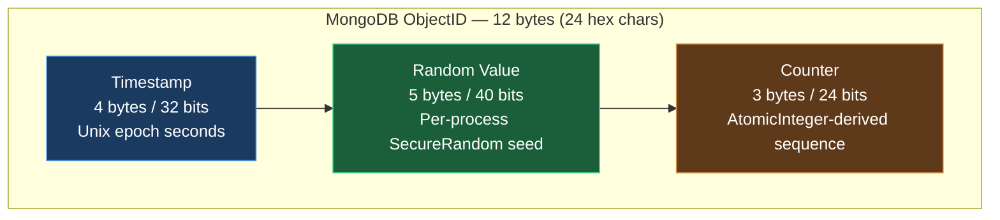
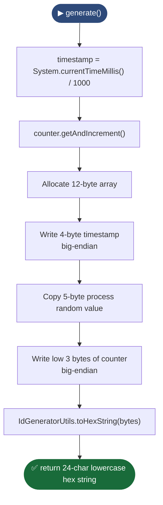
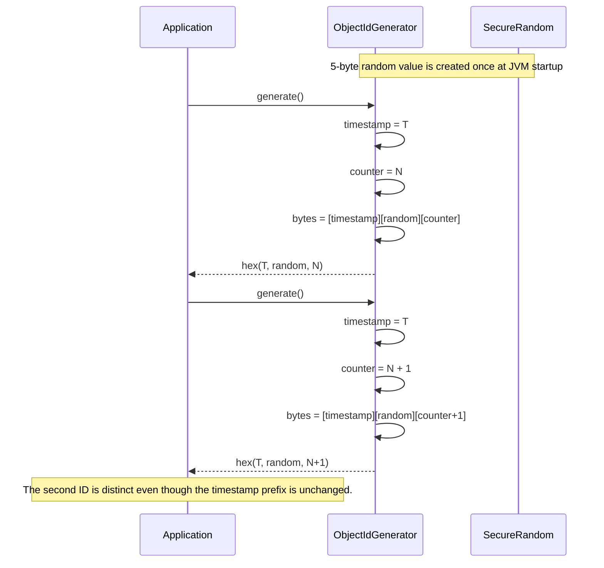
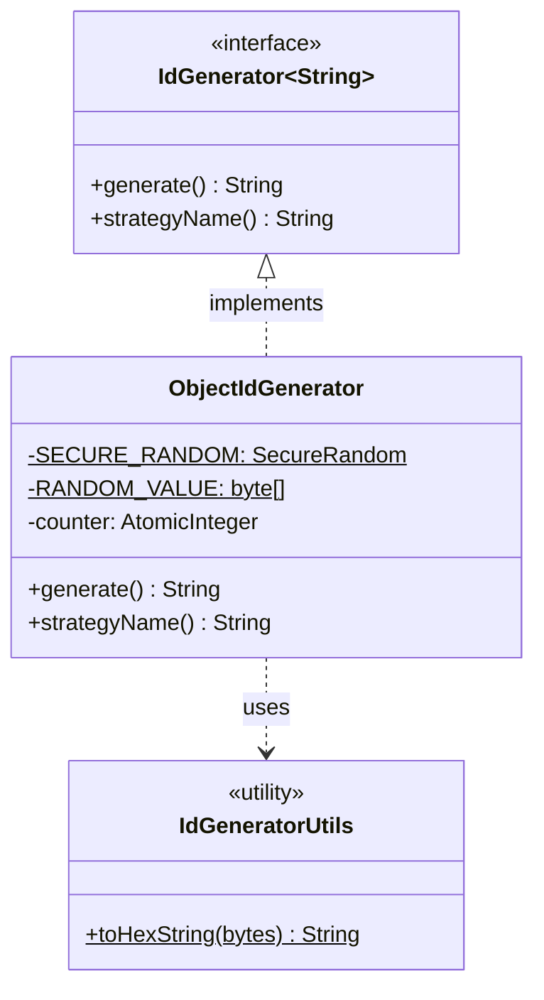

# MongoDB ObjectID Module — Diagrams

## 1. Structure Diagram — Anatomy of a 12-byte ObjectID

## 2. Flowchart — `ObjectIdGenerator.generate()` algorithm

## 3. Sequence Diagram — Two IDs generated in the same second

## 4. Class Diagram

