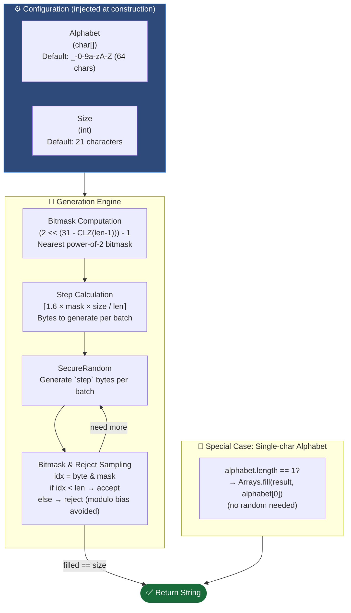
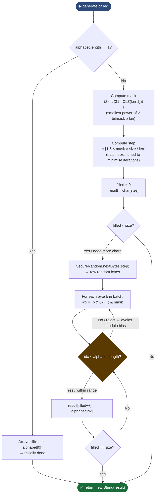
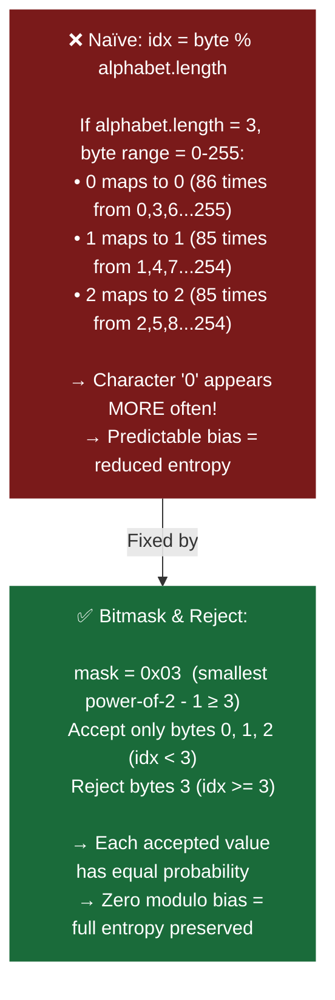
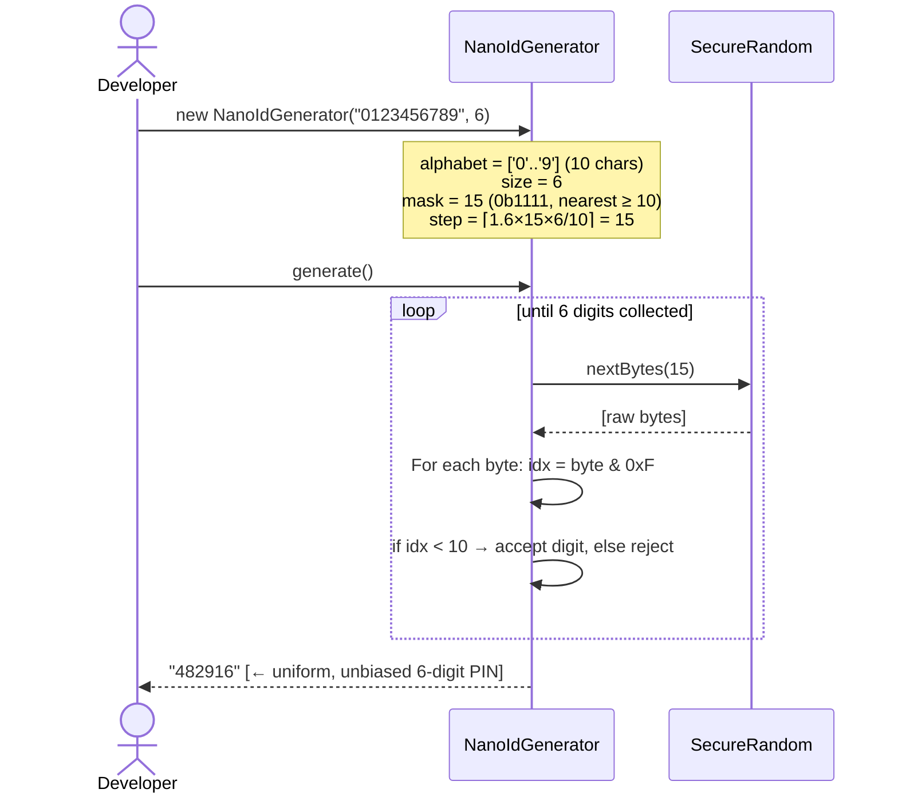
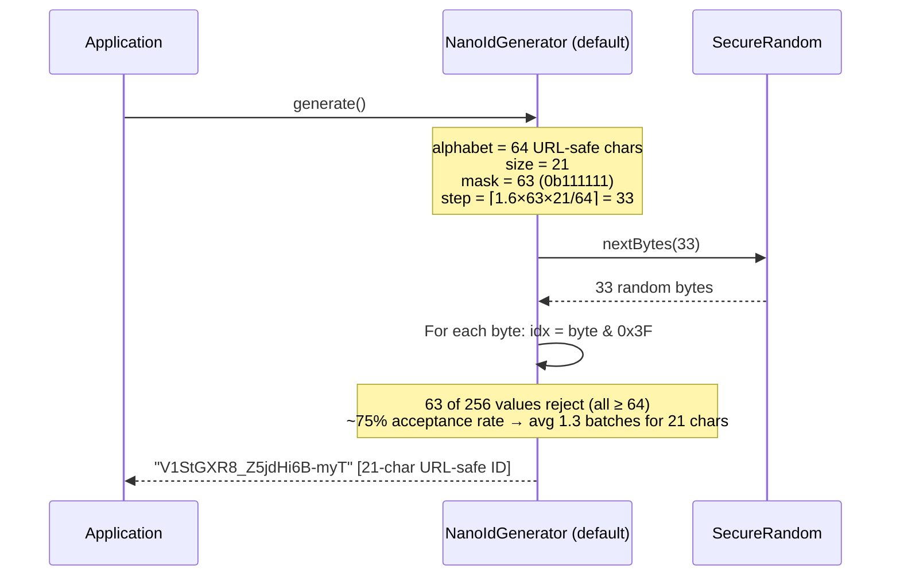
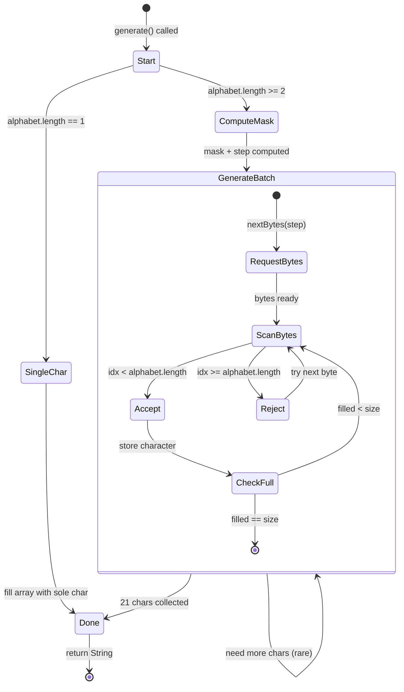
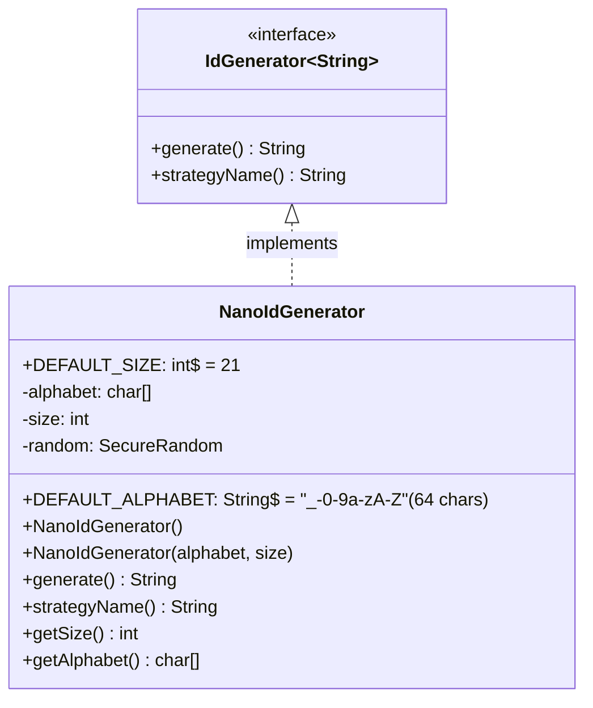

# NanoID Module — Diagrams

## 1. Component Diagram — NanoID configurable design

---

## 2. Flowchart — `NanoIdGenerator.generate()` with bitmask-and-reject

---

## 3. Diagram — Why modulo bias matters

---

## 4. Sequence Diagram — Custom NanoID for PIN generation

---

## 5. Sequence Diagram — Default NanoID generation

---

## 6. State Diagram — NanoID generation retry loop

---

## 7. Class Diagram

