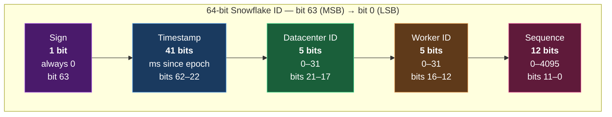
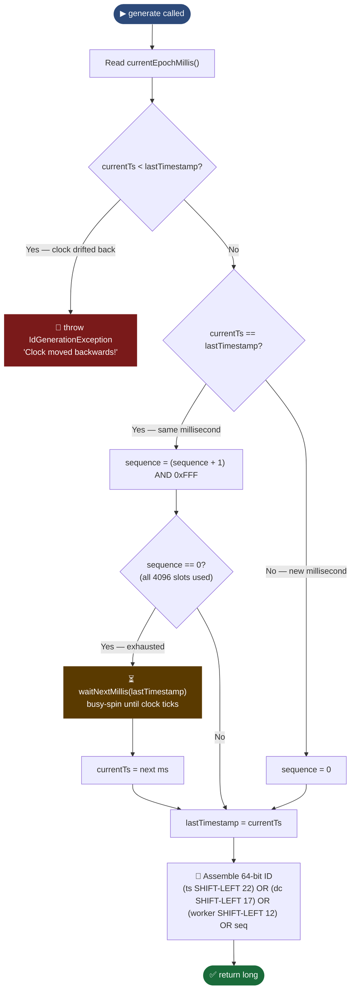
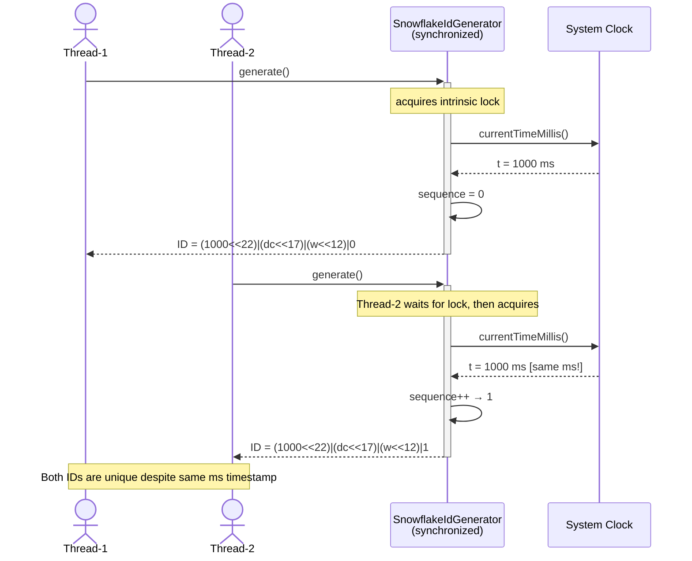
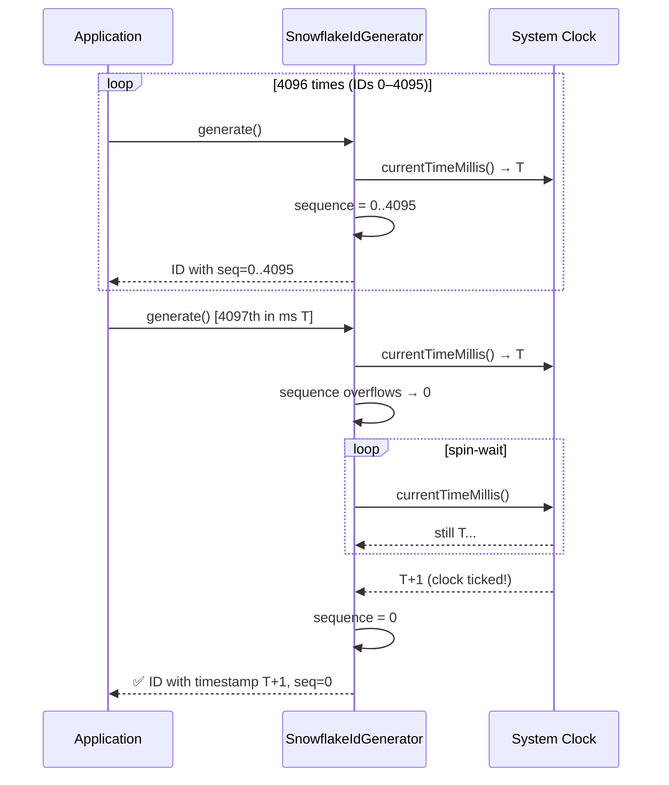
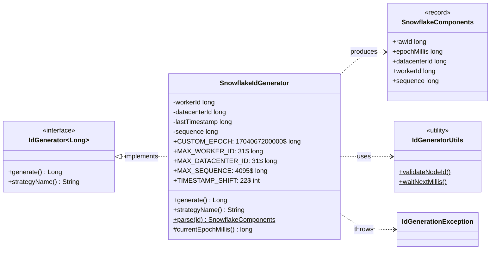
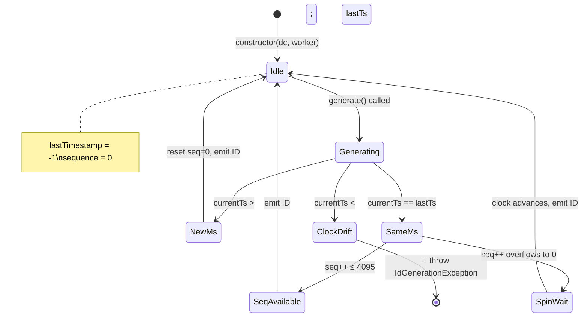

# Snowflake Module — Diagrams

## 1. Bit-Layout Diagram — Anatomy of a 64-bit Snowflake ID

> **Reading guide:** bit 63 (leftmost) is always `0` — guarantees a positive `long`.  
> Bits 62–22 hold the 41-bit timestamp. Bits 21–17 hold the 5-bit datacenter ID.  
> Bits 16–12 hold the 5-bit worker ID. Bits 11–0 hold the 12-bit per-ms sequence.

---

## 2. Flowchart — `SnowflakeIdGenerator.generate()` algorithm

---

## 3. Sequence Diagram — Concurrent ID generation by two threads

---

## 4. Sequence Diagram — Sequence exhaustion & spin-wait

---

## 5. Class Diagram — `SnowflakeIdGenerator` internals

---

## 6. State Diagram — Snowflake generator lifecycle

