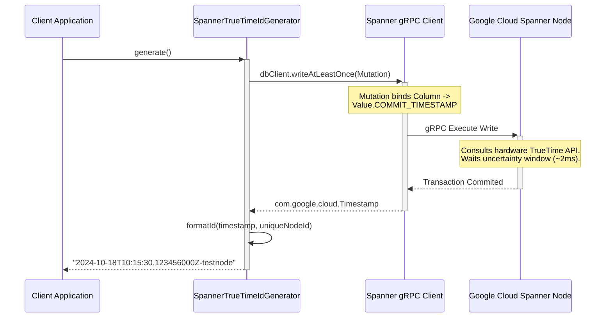
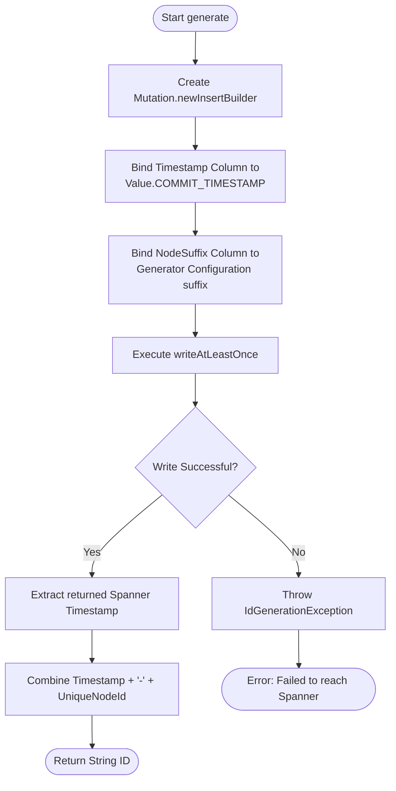
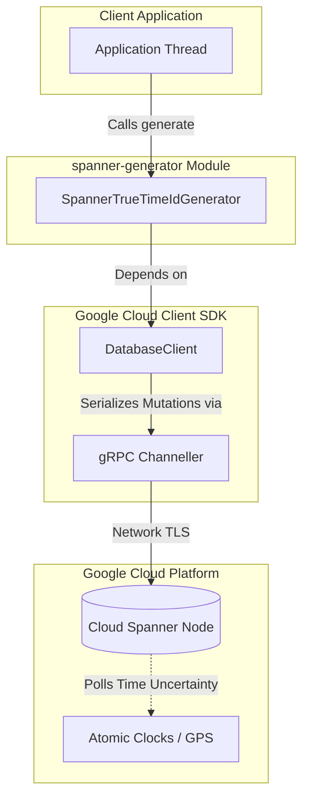

# spanner-generator Diagrams

This document illustrates the internal architecture, database interaction flow, and component structure of the `spanner-generator` (TrueTime Commit Timestamp) ID generator module.

## 1. Sequence Diagram: TrueTime ID Generation
This sequence diagram shows how the Java generator requests a commit timestamp natively from the Google Cloud Spanner coordinator via gRPC without having to generate an ID in memory locally.

## 2. Flowchart: Generation Algorithm
This flowchart details the execution path, demonstrating the blind append-only write that drives the point-in-time extraction.

## 3. Component Diagram
Structural view of how the generator leverages standard Google APIs. Unlike typical SQL JDBC wrappers, this relies entirely on Spanner's custom gRPC SDK.

