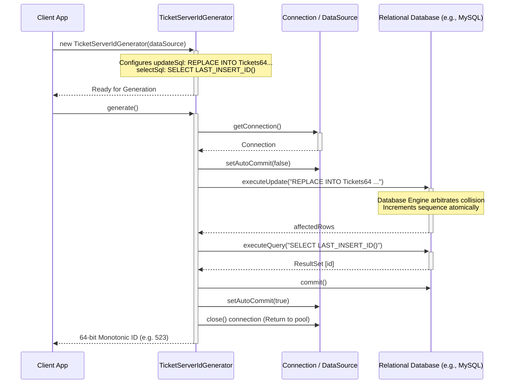
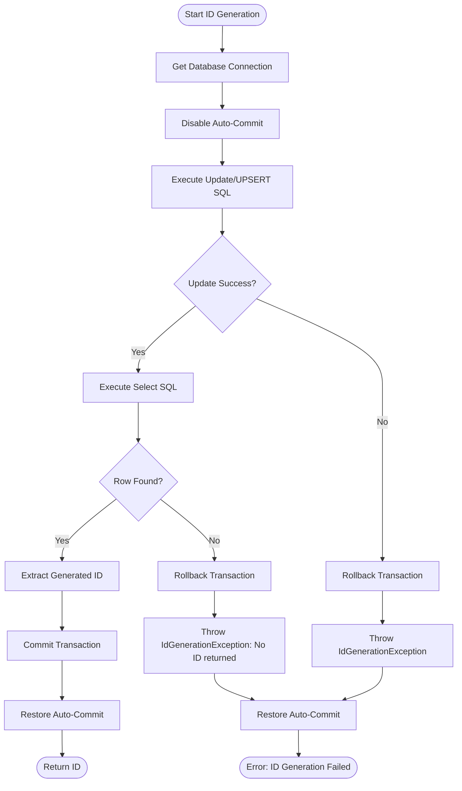
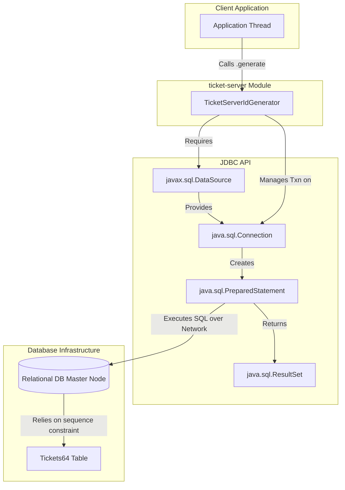

# ticket-server Diagrams

This document illustrates the internal architecture, database interaction flow, and component structure of the `ticket-server` generator module. This module generates perfect sequential 64-bit strictly numeric IDs (1, 2, 3...) utilizing a standard relational database's auto-increment feature with a single table constraint.

## 1. Sequence Diagram: Initialization and Generation
This diagram shows how a client application initializes `TicketServerIdGenerator` and requests IDs. For each ID requested, the generator establishes a database transaction, executes the UPSERT (`REPLACE INTO`), fetches the returned ID, commits the transaction, and returns the result.

## 2. Flowchart: Database ID Reservation Algorithm
This flowchart details the algorithm used by `TicketServerIdGenerator` when `.generate()` is invoked. It emphasizes the strict deterministic transactional boundary surrounding the two essential SQL statements.

## 3. Component Diagram
This flowchart structurally outlines the `ticket-server` architecture. Notice how the core engine acts primarily as a network proxy funneling requests straight toward a centralized database engine orchestrator.

