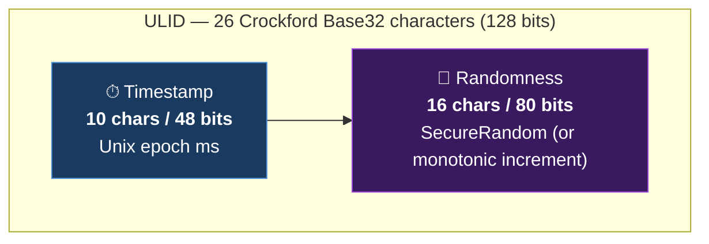
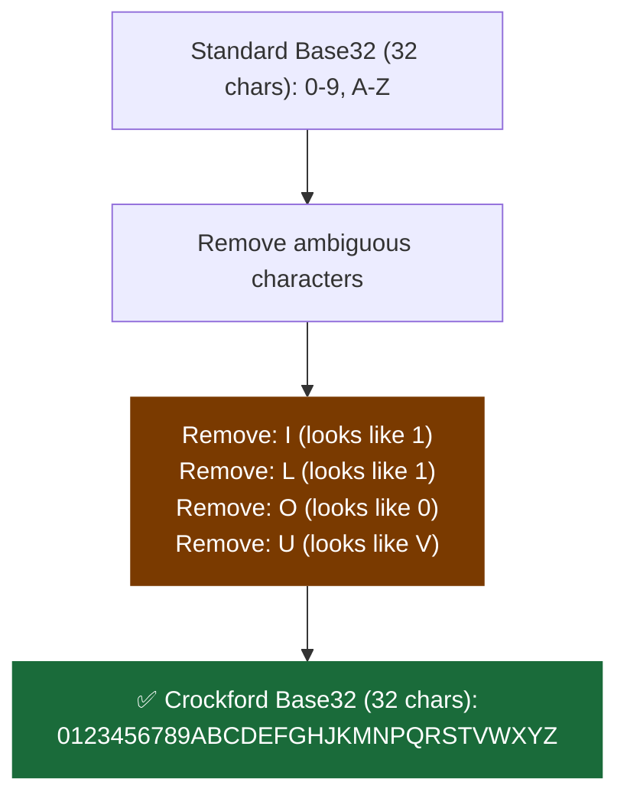
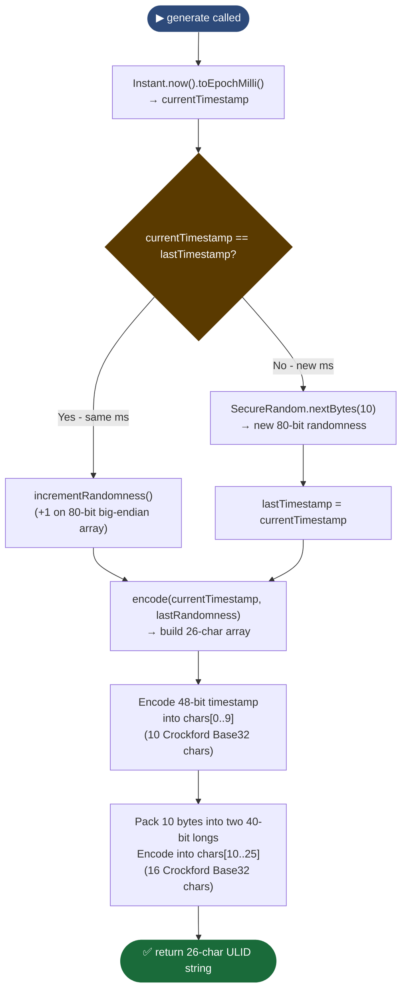
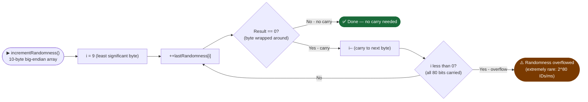
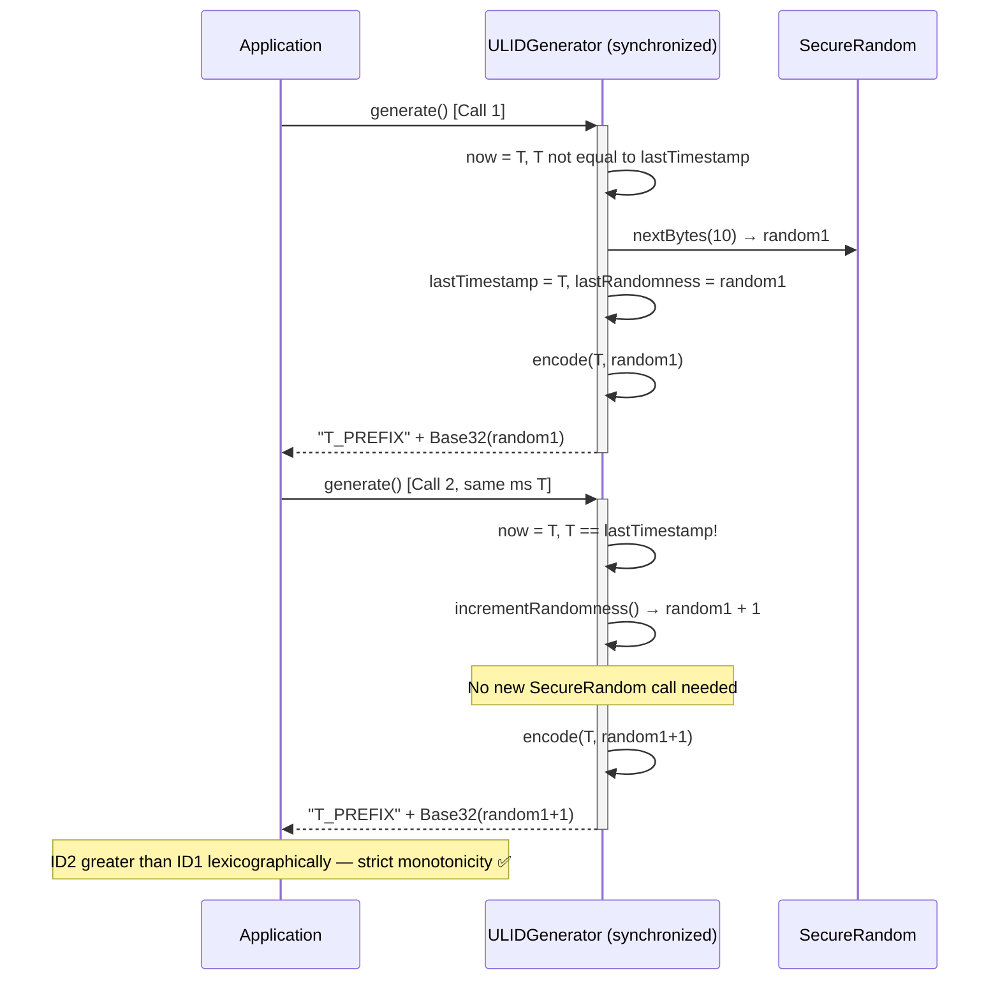
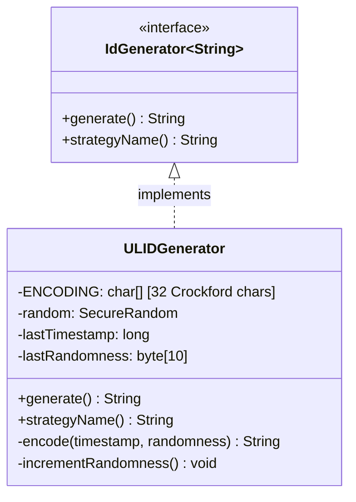
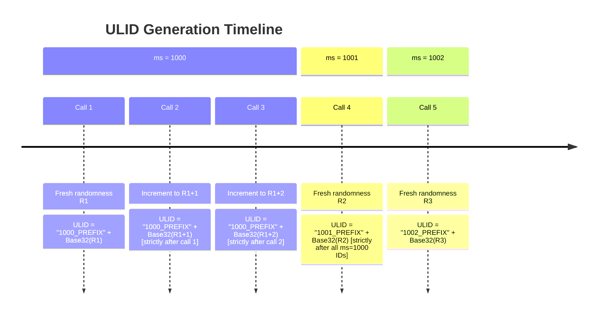

# ULID Module — Diagrams

## 1. Structure Diagram — Anatomy of a 26-character ULID



**Example ULID:** `01ARZ3NDEKTSV4RRFFQ69G5FAV`
```
01ARZ3NDEK  TSV4RRFFQ69G5FAV
──────────  ────────────────
Timestamp   Randomness (80-bit)
(48-bit)
```

---

## 2. Crockford Base32 Alphabet Diagram



---

## 3. Flowchart — `ULIDGenerator.generate()` algorithm



---

## 4. Flowchart — `incrementRandomness()` carry propagation



---

## 5. Sequence Diagram — Two ULIDs in the same millisecond



---

## 6. Class Diagram



---

## 7. Timeline — ULID monotonicity across milliseconds


