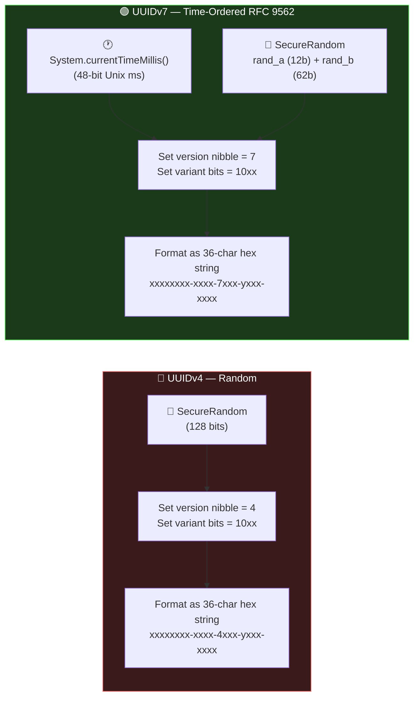
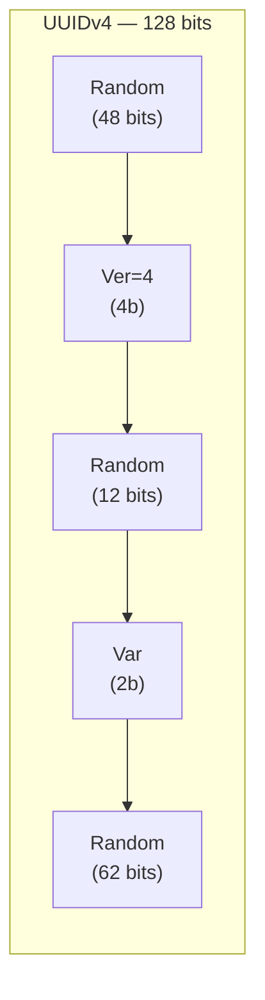
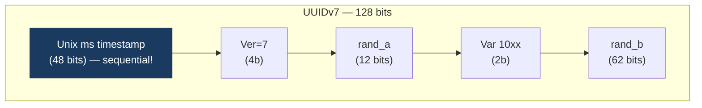
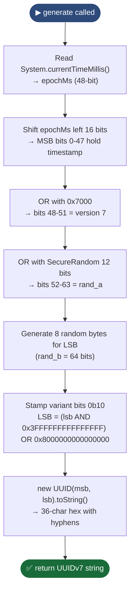
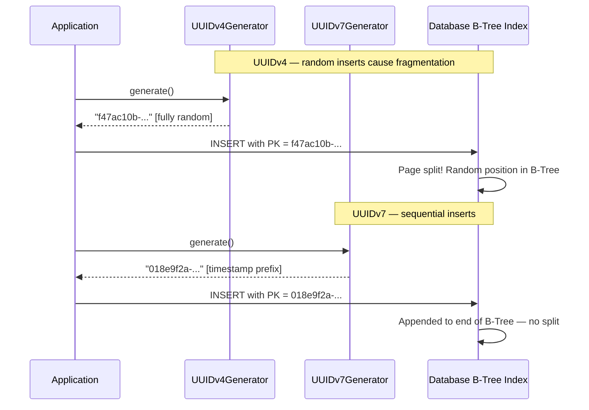
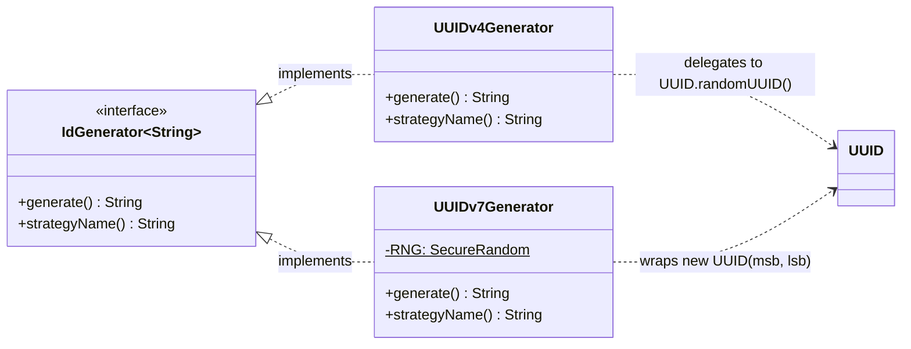
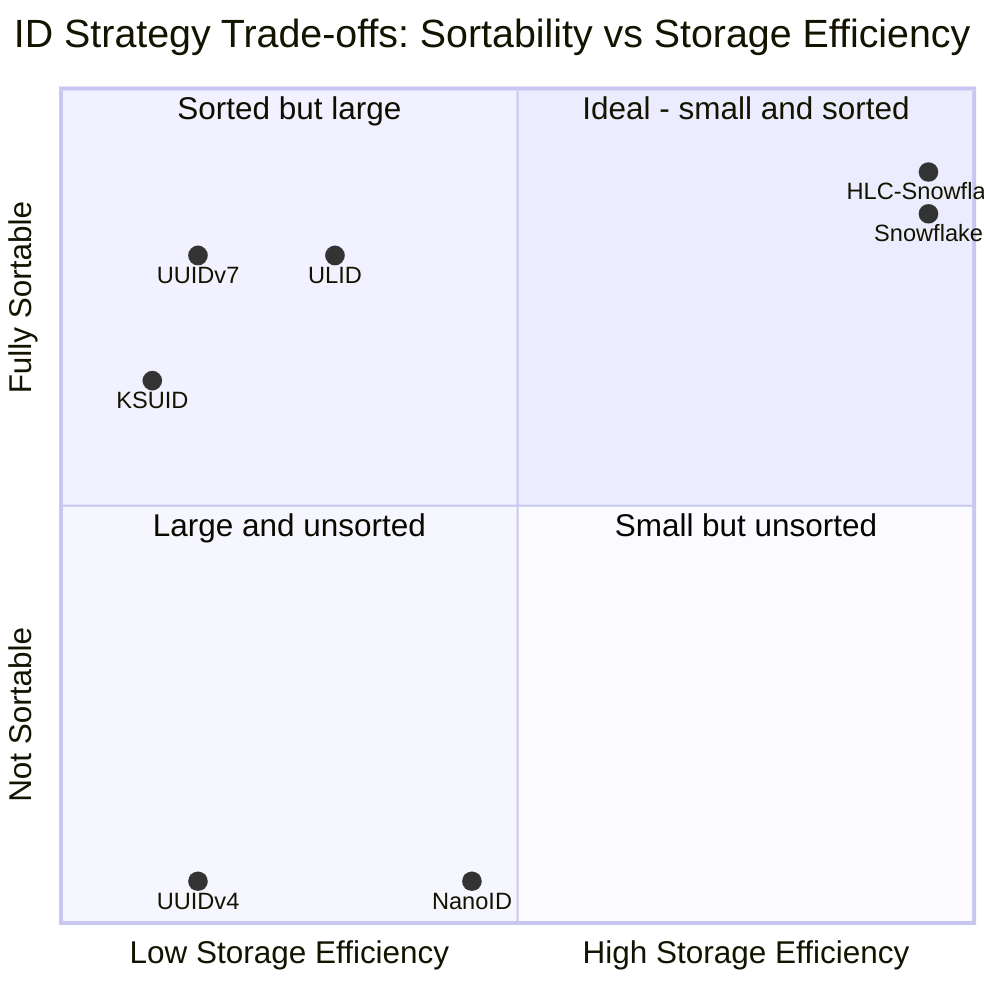

# UUID Generator Module — Diagrams

## 1. Component Diagram — UUIDv4 vs UUIDv7 side-by-side

---

## 2. Bit-Layout Diagram — UUIDv4 (128-bit random)

> ⚠️ **No timestamp = no ordering.** Each insert lands at a random position in the
> B-Tree, causing page splits and index fragmentation at scale.

---

## 3. Bit-Layout Diagram — UUIDv7 (time-ordered, RFC 9562)

> ✅ **Timestamp prefix = sequential inserts.** Records land in chronological order,
> eliminating B-Tree page splits.

---

## 4. Flowchart — `UUIDv7Generator.generate()` construction

---

## 5. Sequence Diagram — UUID generation and DB insert comparison

---

## 6. Class Diagram

---

## 7. Comparison Chart — Sortability vs Storage Efficiency

